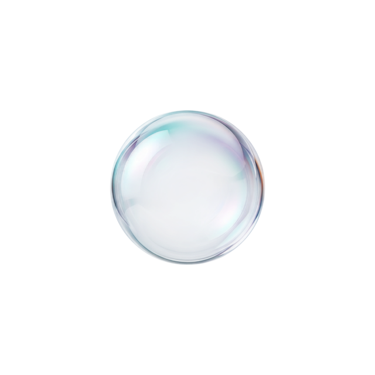
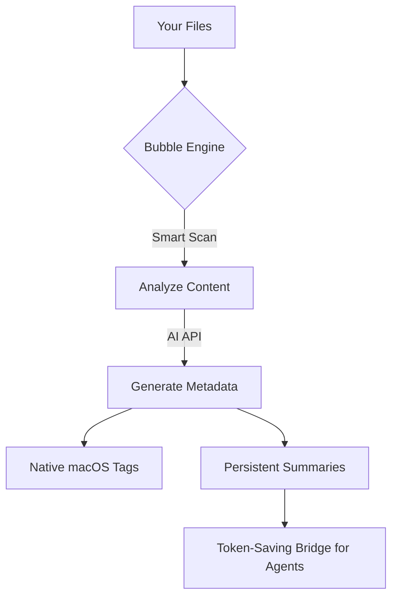

<p align="center">
  
</p>

# 🚀 Bubble

<p align="center">
  <b>made by <a href="https://github.com/jade-kwon">Jade Kwon</a></b>
</p>

<p align="center">
  
  
  
</p>

**Bubble** is the elite toolbox for AI builders. It bridges the gap between your local assets and AI IDEs, providing "magic" utilities like terminal-ready image pasting and intelligent workspace awareness.

---

## ⚡ 1-Minute Setup

### 🍏 macOS (Recommended)
Download the latest **[Bubble.dmg](https://github.com/jade-kwon/bubble/releases/latest/download/Bubble.dmg)**, open it, and drag **Bubble** to your Applications folder.

### 🐧 Linux / Advanced
If you have [Go](https://go.dev/dl/) installed, just run this to get started:

```bash
chmod +x install.sh && ./install.sh
./bubble --provider gemini --api-key YOUR_KEY --save
```


---

## 🤔 How it Works



---

## ✨ Why Bubble?

| **Feature** | Manual Work | With Bubble |
| :--- | :--- | :--- |
| **Search** | Brute force file naming | Instant search by `tag:python` |
| **Context** | Read 100 files to find code | Scan 100 summaries in seconds |
| **Smart Paste** | Manual image saving | **Terminal-ready** image paths |
| **Cost** | High token usage for AI | **95% token savings** |

---

## ⚙️ Detailed Platform Guides

- **🍏 macOS App:** Open the `BubbleMacOS` folder in Xcode (it's a Swift Package) and press `Cmd+R` to run the Menu Bar app.
- **🐧 Linux CLI:** High-performance Go binary (`bubble`) located in `BubbleLinuxGo`. Get pre-compiled versions for Linux, macOS, and Windows in the **[Releases](https://github.com/jade-kwon/bubble/releases)** section.
- **Bridge / MCP:** Use the `bubble-mcp` server to let your AI agents (Claude, etc.) map your project instantly.

---

## 🤝 Community & Contributing
Contributions are welcome! See [CONTRIBUTING.md](./CONTRIBUTING.md) for details.

---

## ❓ FAQ

**Q: Which model should I use?**
A: **Gemini 2.5 Flash** is highly recommended for its speed, low cost, and huge context window.

**Q: Does this work on Windows?**
A: The Go CLI can be compiled for Windows, but it is currently optimized and tested for **macOS** and **Linux**.

**Q: Is my data safe?**
A: Yes. AITagger only sends the *content* of your files to your chosen AI provider (Google, OpenAI, or Anthropic). No data is stored on our servers.

---

## 📄 License
**Bubble** is released under the **MIT License**. See [LICENSE](./LICENSE) for details.

